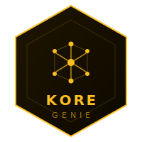

<p align="center">
  
</p>

# kore-genie • Socle IA Privée & RAG Entreprise

## Le nom

**K** comme Kouba. **ORE** comme *core* — le socle.

Ce n'est pas un acronyme inventé après coup. Le nom est venu naturellement : une identité derrière, une philosophie devant. Construire des fondations solides avant de construire des fonctionnalités. Penser architecture avant code.

**KORE** est un projet open source destiné à la communauté. kore-genie en est la première brique.

---

## L'écosystème KORE

kore-genie s'inscrit dans un écosystème plus large. Chaque brique suit la même logique : documentée, testée, utile.

| Brique | Description | Statut |
|---|---|---|
| [kore-hexagonal](https://github.com/alak8ba/kore-hexagonal) | Architecture hexagonale Java | Disponible |
| [kore-batch](https://github.com/alak8ba/kore-batch) | Traitement par lots robuste | Disponible |
| **kore-genie** | Socle IA privée & RAG entreprise | En cours |
| kore-stream | Traitement de flux temps réel | Prévu |
| kore-react | Composants frontend réutilisables | Prévu |

---

## Contexte

La majorité des entreprises qui veulent exploiter l'IA générative se heurtent à un problème fondamental : leurs données sont confidentielles et ne peuvent pas transiter vers des services cloud publics (ChatGPT, Claude, Gemini).

**kore-genie** est un socle technique qui répond directement à ce problème. Il permet de déployer une IA conversationnelle capable de raisonner sur les données métier internes d'une entreprise, entièrement déconnectée du cloud, sans aucune dépendance propriétaire.

C'est une démonstration concrète d'une capacité : **mettre en place une IA privée, souveraine et opérationnelle** pour un client, dans son infrastructure, avec ses documents.

---

## Philosophie

- **Zéro donnée sortante** • aucun token ne quitte le périmètre de l'entreprise
- **Un socle, N domaines** • agnostique du métier, chaque projet implémente son propre corpus
- **Open source only** • LLaMA, Ollama, LangChain4j, Chroma • aucune dépendance propriétaire
- **Progressif** • un MVP fonctionnel en quelques jours, extensible ensuite

---

## Cas d'usage ciblés

| Domaine | Exemple |
|---|---|
| Documentation interne | "Comment fonctionne notre processus de validation ?" |
| Base de connaissance RH | "Quels sont les congés auxquels j'ai droit ?" |
| Support technique | "Pourquoi cette erreur apparaît dans nos logs ?" |
| Juridique / conformité | "Notre contrat respecte-t-il la clause RGPD ?" |
| Code legacy | "Qu'est-ce que fait cette méthode dans ce module ?" |

---

## Architecture cible

```
[Documents internes]
  PDF, Word, Markdown, code source
        |
  [Ingestion Pipeline]
  Chunking, embedding, indexation
        |
  [Vector Store]
  Chroma / Milvus (on-premise)
        |
  [RAG Engine]
  Retrieval + Prompt construction
        |
  [LLM Local]
  LLaMA 3 via Ollama
        |
  [API REST]
  Spring Boot 3 / Java 21
        |
  [Interface]
  Chat UI Angular ou API exposée
```

---

## Stack technique

| Couche | Technologie |
|---|---|
| LLM | LLaMA 3 (Meta) via Ollama |
| Orchestration IA | LangChain4j (Java natif) |
| Vector Store | Chroma DB |
| Ingestion | Apache Tika (parsing PDF/Word) |
| Backend | Spring Boot 3 / Java 21 |
| API | REST + WebSocket (streaming) |
| Frontend | Angular 17 |
| Déploiement | Docker Compose, on-premise |

---

## Concepts clés

### RAG • Retrieval Augmented Generation

Le LLM seul ne connaît pas vos données internes. Le RAG consiste à :

1. Indexer les documents de l'entreprise sous forme de vecteurs
2. Récupérer les passages les plus pertinents à chaque question
3. Injecter ces passages dans le prompt envoyé au LLM
4. Générer une réponse contextualisée

> Le LLM ne mémorise rien • il raisonne sur ce qu'on lui donne à chaque appel.

### Embeddings

Représentation vectorielle d'un texte. Deux textes sémantiquement proches ont des vecteurs proches dans l'espace. C'est ce qui permet la recherche par **sens** et non par mots-clés exacts.

### Ollama

Outil permettant de faire tourner des LLMs open source en local (LLaMA, Mistral, Gemma...) sans GPU cloud, sur une machine standard ou un serveur on-premise.

---

## Statut

> Socle en construction active. Les bases techniques sont posées, l'implémentation avance étape par étape.

Voir [`docs/`](docs/) pour le détail de chaque étape.
